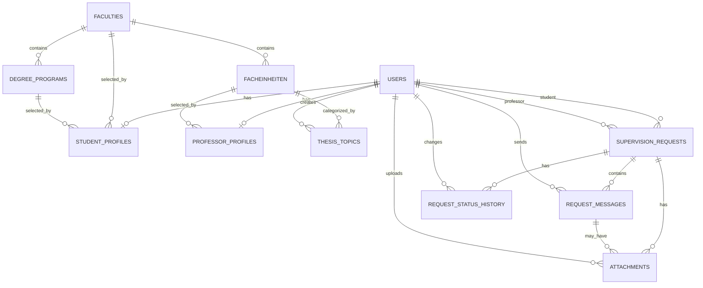

# Data Model

The application uses SQLite as the database technology and Flask-SQLAlchemy as the ORM layer.  
The database file is located in `instance/thesis_match.sqlite`.

The SQLAlchemy model classes are defined in `db.py`. These classes are the source of truth for the current database structure.

## Main entities

### User

The `User` model stores the login and account data for both students and professors.

Important fields:
- `id`
- `email`
- `password_hash`
- `first_name`
- `last_name`
- `role`
- `account_status`
- `created_at`

The `role` field separates students and professors.

Relationships:
- One user can have one `StudentProfile`
- One user can have one `ProfessorProfile`
- A user can be connected to many supervision requests as student or professor

### StudentProfile

The `StudentProfile` model stores student-specific profile information.

Important fields:
- `user_id`
- `matriculation_number`
- `faculty_id`
- `degree_program_id`
- `semester`
- `study_focus`

Relationships:
- Belongs to one `User`
- Can reference one `Faculty`
- Can reference one `DegreeProgram`

### ProfessorProfile

The `ProfessorProfile` model stores professor-specific profile information.

Important fields:
- `user_id`
- `facheinheit_id`
- `title`
- `research_areas`
- `requirements`
- `max_supervisions`
- `accepting_requests`

Relationships:
- Belongs to one `User`
- Can reference one `Facheinheit`

### Faculty

The `Faculty` model stores faculties so users do not enter faculty names manually.

Important fields:
- `id`
- `code`
- `name`
- `created_at`

Relationships:
- One faculty can have many degree programs
- One faculty can have many Facheinheiten
- Student profiles reference a faculty directly; professor profiles reference a faculty indirectly via their Facheinheit

### DegreeProgram

The `DegreeProgram` model stores study programs connected to a faculty.

Important fields:
- `id`
- `faculty_id`
- `name`
- `degree`

Relationships:
- Belongs to one `Faculty`
- Can be referenced by student profiles

### Facheinheit

The `Facheinheit` model stores the academic units (sub-departments) within a faculty. Professors are assigned to a Facheinheit, and the professor feed can be filtered by it.

Important fields:
- `id`
- `faculty_id`
- `name`

Relationships:
- Belongs to one `Faculty`
- Can be referenced by many professor profiles
- Can be referenced by many thesis topics

### SupervisionRequest

The `SupervisionRequest` model represents a student request to a professor for bachelor thesis supervision.

Important fields:
- `id`
- `student_id`
- `professor_id`
- `proposed_title`
- `short_description`
- `preferred_period`
- `status`
- `created_at`
- `updated_at`

Relationships:
- Belongs to one student user
- Belongs to one professor user
- Can have many request messages
- Can have many attachments
- Can have status history entries

### RequestMessage

The `RequestMessage` model stores messages in the request-related chat.

Important fields:
- `id`
- `request_id`
- `sender_id`
- `message_text`
- `created_at`

Relationships:
- Belongs to one `SupervisionRequest`
- Belongs to one sender user
- Can have attachments

### Attachment

The `Attachment` model stores metadata for uploaded PDF files.

Important fields:
- `id`
- `request_id`
- `message_id`
- `uploaded_by`
- `attachment_context`
- `original_filename`
- `storage_path`
- `mime_type`
- `file_size`
- `created_at`

Only metadata is stored in the database. The actual uploaded PDF files are stored in the application upload folder.

### ThesisTopic

The `ThesisTopic` model stores thesis topics proposed by professors.

Important fields:
- `id`
- `professor_id`
- `facheinheit_id`
- `title`
- `description`
- `requirements`
- `topic_area`
- `status`
- `created_at`
- `updated_at`

Relationships:
- Belongs to one professor user
- Can reference one `Facheinheit`

### RequestStatusHistory

The `RequestStatusHistory` model stores status changes for supervision requests.

Important fields:
- `id`
- `request_id`
- `old_status`
- `new_status`
- `changed_by`
- `comment`
- `created_at`

Relationships:
- Belongs to one `SupervisionRequest`
- Stores which user changed the status

## ER diagram

